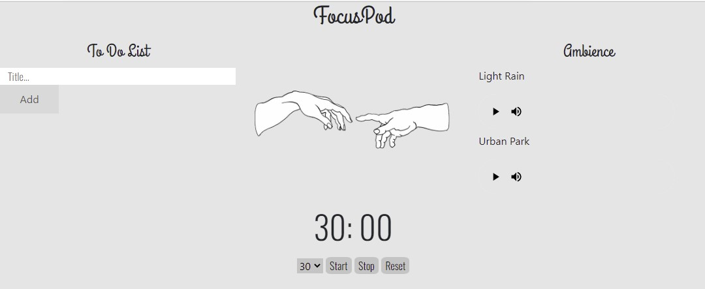
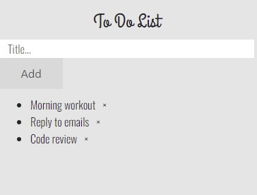
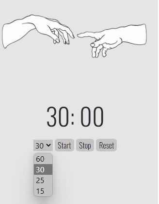
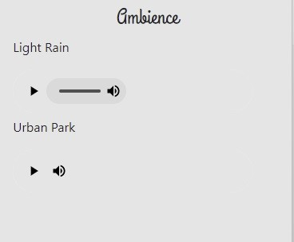

<h1 align="center">
    FOCUSPOD
</h1>
<h3 align="center">
    A simple productivity web app.
</h3>
 

    

<h3> :computer: Features</h3>

<h4><b>To Do List</b></h4>
 

 
    

 NOTE : When you refresh the page all your progress will be lost (Lack of backend) 

<h3><b>Timer</b></h3>
 

 
    

 NOTE : Limited only to 15,25,30 & 60 minutes

<h3><b>Ambient sounds</b></h3>
 

 
    

These are ambient sounds used as whitenoise

NOTE: More sounds will be added

